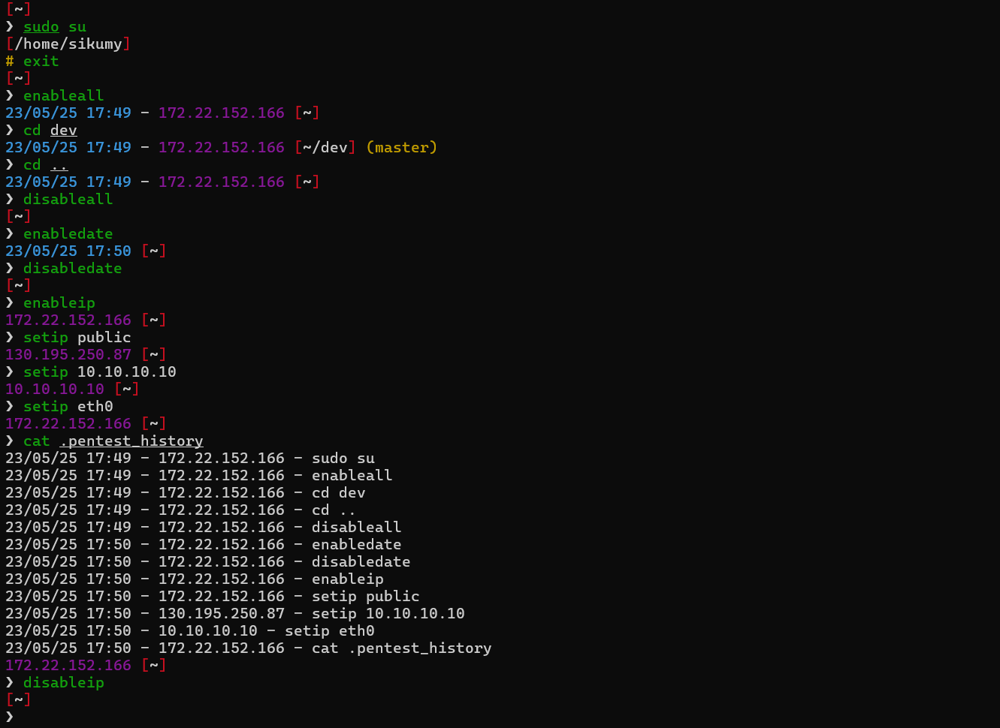

# Oh My Pentest Report Zsh Theme

`ohmy-pentest-report.zsh-theme` is a customizable Oh My Zsh theme specifically designed for pentesters, offering a clean and efficient prompt to streamline daily tasks during audits and penetration testing. The theme includes real-time display of the date, time, IP address, current directory, and the result of the last executed command. The inclusion of date and time is particularly useful for reporting, allowing pentesters to clearly track when tests were executed, making it easier to document results. Additionally, the theme provides flexibility for manual or automatic IP configuration, custom symbols, custom command history logging, and other features tailored to enhance a pentester's workflow.

## Features

- **Optional Date and Time Display**: Enable or disable the display of the current date and time in cyan for easy readability using `enabledate` and `disabledate` commands.
- **Dynamic IP Address**: Optionally show the IP from a specific interface (e.g., `tun0`), a manually set IP, or the public IP address.
  - Set IP manually or automatically using the `setip` function.
  - Toggle showing the IP with `enableip` and `disableip` commands.
- **Command Execution Status**: 
  - A white `❯` symbol indicates successful command execution.
  - A red `❯` symbol shows when the previous command failed.
  - If the user is `root`, the prompt shows `#` in yellow. Just like with a regular user, the prompt will turn red if the last command failed.
- **Current Directory**: The prompt shows the current working directory within brackets in red and white.
- **Two-Line Prompt Option**: Customize the prompt to use a two-line format by editing the theme file, allowing the command input to appear on a new line (enabled by default).
- **Custom Command History Logging**:
    - All executed commands are logged to `~/.pentest_history` in the format `DATE - IP - COMMAND`.
    - Logging occurs regardless of whether the date and IP are displayed in the prompt.
    - Empty commands (e.g., pressing Enter on an empty line) or aborted commands (e.g., pressing `Ctrl+C`) are not logged.
- **Customizable Interface**: Easily switch between displaying an IP from an interface, a manually set IP address, or the public IP.
- **Git Branch & Status Display**: When you’re inside a Git repository, the prompt shows the current branch in parentheses.

## Oh My Zsh Installation

1. First, make sure you have ZSH installed:
```bash
sudo apt install zsh -y
```
2. You can set ZSH as the default shell with the following command:
```bash
chsh -s $(which zsh)
```
3. Once you have ZSH installed and set as the default shell, you can download Oh My Zsh with the following command:
```bash
sh -c "$(curl -fsSL https://raw.github.com/ohmyzsh/ohmyzsh/master/tools/install.sh)"
```

## Installation

1. **Clone the repository** into your custom themes directory:
```bash
git clone https://github.com/sikumy/ohmy-pentest-report/ $ZSH_CUSTOM/themes/ohmy-pentest-report
mv $ZSH_CUSTOM/themes/ohmy-pentest-report/ohmy-pentest-report.zsh-theme ~/.oh-my-zsh/themes/ohmy-pentest-report.zsh-theme
```
2. **Set the theme** in your `.zshrc`:
```bash
sed -i 's/ZSH_THEME=".*"/ZSH_THEME="ohmy-pentest-report"/' ~/.zshrc
```
3. **Add the following line to your `.zshrc`** before `"source $ZSH/oh-my-zsh.sh"` to fix/enable Git branch display in the prompt ([why?](https://github.com/ohmyzsh/ohmyzsh/issues/12328)).
```bash
zstyle ':omz:alpha:lib:git' async-prompt force
```
4. **Reload your terminal**:
```bash
exec $SHELL
```
## Usage

By default, both the IP address and date/time display are disabled. You can enable them as needed using the provided commands.

### Enable or Disable Date and Time in the Prompt

- Enable Date and Time Display:
```bash
enabledate
```
The prompt will now display the date and time in cyan.

- Disable Date and Time Display:
```bash
disabledate
```
The date and time will be removed from the prompt.

### Enable or Disable IP Address in the Prompt

- Enable IP Display:
```bash
enableip
```
The prompt will now display the IP address.

- Disable IP Display:
```bash
disableip
```
The IP address will be removed from the prompt.

#### Set a Specific IP

##### To manually set an IP:
   ```bash
   setip 192.168.1.100
   ```

##### Use an Interface to Get the IP

   To get the IP address from a specific network interface:
   ```bash
   setip eth0
   ```

##### Get the Public IP (Useful for Web Assessments or External Pentests)

   You can display the public IP address, which is particularly useful for web assessments or external penetration testing:
   ```bash
   setip public
   ```
   The public IP will be refreshed automatically every 1 minutes.

### Enable or Disable All

Enable IP and Date/Time in Prompt:
```bash
enableall
```
Disable IP and Date/Time in Prompt:
```bash
disableall
```

## Custom Command History Logging

All executed commands are logged to `~/.pentest_history` in the format `DATE - IP - COMMAND`, regardless of whether the date and IP are displayed in the prompt. This feature is particularly useful for reporting and keeping track of activities during a penetration test.

- Logging Details:
  - The history file is automatically created in your home directory.
  - Empty commands (e.g., pressing Enter on an empty line) or aborted commands (e.g., pressing `Ctrl+C`) are not logged.
  - The IP logged is based on your current configuration (manual IP, interface IP, or public IP).
- Example Entry:
```
28/10/23 16:38 - 192.168.1.100 - nmap -sV target.com
```

## Default Two-Line Prompt

By default, this theme uses a two-line prompt layout to keep the prompt information (date/time, IP, directory, Git status, etc.) separate from your command entry.  
This is especially helpful when all features are enabled, as the prompt can become quite long. A two-line format improves readability and usability in such cases.

- **Revert to a Single-Line Prompt**: If you prefer a more compact prompt, you can switch back to a single-line format by editing the theme file `ohmy-pentest-report.zsh-theme` and setting the following:
```
# Control to use a two-line prompt (enabled by default)
twolines=false  # Set to false to disable two-line prompt
```

## Additional Customization

You can further customize the prompt by editing the theme file and modifying variables such as the date format, symbol styles, and colors.
- **Date Format**: Modify the `date` command in the `get_datetime` function to change how the date and time are displayed.
- **Prompt Symbols**: Customize `cmd_symbol_success`, `cmd_symbol_fail`, and `cmd_symbol_root` for different symbols or colors.
- **Colors**: Change color codes within the prompt components to suit your preferences.


## Screenshots

   Here's an example of how the prompt looks:

   

## Contributions

   Contributions, issues, and feature requests are welcome! Feel free to check out the [issues](https://github.com/sikumy/ohmy-pentest-report/issues) page if you want to contribute.
